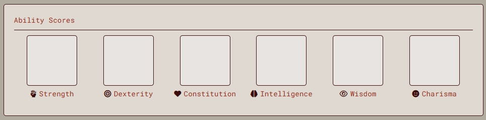
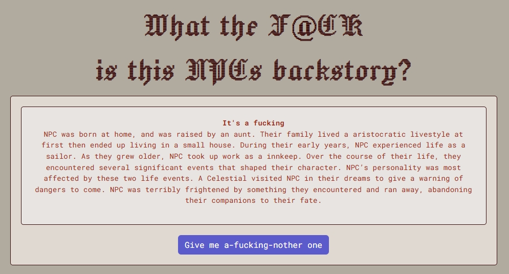

# Who the F@CK is this NPC?

Project by Abby Friesen, Tyler Lee and Fraser McEvoy

## Application Overview
**Who the F@CK is this NPC?** is a web application that will allow users to create NPCs (Non-Playable Characters)  for their Tabletop Roleplaying Games (TTRPGs) at the click of a button. Whether the user wants to choose every aspect of the character, build from a template or randomize everything, our site will oblige.

### Who is this for?

Game Masters (GMs), people who run TTRPGs for a group of players, are terribly busy. They need to craft an elaborate story within a world of their creation filled with adventure, creatures, and quests. Moreover, they need to populate that world with NPCs to give out these quests and adventures.

There are plenty of character creators out there but there are far fewer NPC specific creators that deliver an NPC complete with stats and a backstory. This unique site will support the basic ruleset of the most popular TTRPG currently, D&D, but these NPCs could easily be used for any game with small modifications to suit your ruleset.  

## Usage & Installation
### Recommended Usage
No installation necessary! The application is used to its full potential via our GitHub hosted live page. You can access it here, [Who the F@CK is this NPC?](https://raeoffrost.github.io/NPC-Maker/). The readme doubles as the documentation for this project.

### Local Installation
If you would like to use the project locally you can clone the git repository. 
The project includes the following dependencies for full :

 - Bootstrap API
 - Google Fonts
 - WTF Engine
 
 An internet connection will be required for proper site styling to display.

## Features
You can also watch this short video that goes over the features and usage! 

### Manual Fill
  
The character sheet is a fully editable form that allows you to create a character manually. Upon selecting the character race, the Racial Abilities section will populate. This section will auto-fill whenever you select a new race and can be edited for customization.

You can edit everything from name to their individual skills. There is a notes section to gather your thoughts and a languages section were you can fill in what languages work for your campaign setting. 

The clear button will let you completely start over when you are ready to make your next character.

There is currently no save function so please take a screenshot of your character when completed.

### Random Fill
  
If you are low on time or looking for new ideas you can get a fully random character.

Clicking randomize provides a class, race and subrace as well as ability scores, skills and saving throws. The character speed, alignment and size also fill in randomly. The name section is filled with a randomized number that you can use to keep track of your ideas. 

> Please note: By selecting Random Fill  all values currently selected will be replaced.

### Recommended Fill 
  
A randomized character can have some pretty wild stats so if you are looking for something more by-the-book you can use our recommended generation.

Clicking recommended provides a class, race and subrace as well as ability scores that are tailored to the selector race and class. The speed will also fill in with the speed as determined by the race. With this option you can still randomize a new NPC while still having a well built character. You can select skills, saving throws, size, and alignment manually for extra customization.

> Please note: By selecting Recommended Fill  all values currently selected will be replaced.

### Backstory Generator
  
Lastly, your NPC is going to need a story. What will you say when the players start asking about the NPC's history?

That's where our *What the F@CK is this NPCs backstory?* feature comes in.

Randomly generate nearly endless stories to give your NPC a birthplace, parentage, a childhood home and family wealth. This also generates the NPCs lifestyle, occupation and two unique life events. This feature is thanks to WTF Engine filling in the blanks of a madlibs-esque story outline.

## Roll for... Credits!
This project was created as a college-level group project. Below are the roles each member played and the features they worked on.

**Abby Friesen**
Team Lead, Developer, Designer, Writer

Abby created the design mock up for the site and outlined the form logic and feature breakdown. She assigned tasks to the group and organized meetings. She currently manages the GitHub, the project and issues board, merge conflicts, pull requests and further troubleshooting. Abby also worked on optimizing the HTML and CSS. Abby created the responsive site experience and wrote the documentation/readme. The backstory generator, WTF Engine integration, was also added by Abby. She wrote the backstory outline and all the array data the generator pulls from.

**Tyler Lee**
Developer

Tyler created the randomizer JavaScript. He scripted the form data to fill upon clicking randomize and set up the data randomization functions the main character sheet. Tyler also created the recommended generation script. This script contains a large array of preset characters created by Tyler to suit the D&D 5e ruleset. This script is also set to fill the form upon selecting recommended. The Racial Abilities also fill in upon selection the character race. This feature was created by Tyler with data delivered by Abby.

**Fraser McEvoy**
Developer

Fraser created the site HTML structure. He worked based on the design mockups and prepared the site for future edits. Fraser also set up the base for the CSS and the form CSS interactivity.

**Video**
The presentation video was recorded by the full team. 
Script written by Abby.
Edited by Abby.
Background music by Fraser.

### Project Creator
If you would like to work with this project's code or view the project timeline you can view the project board at [this link](https://github.com/users/raeoffrost/projects/1/views/1) and the issues board at [this link](https://github.com/raeoffrost/NPC-Maker/issues).
The branch structure can be seen at [this link](https://github.com/raeoffrost/NPC-Maker/branches). A short break down of the branch structure is as follows:

 - feature/ - Branches with this prefix are JavaScript features
 - styling/ - Branches with this prefix are HTML and CSS features
 - bug-fix/ - Branches with this prefix are for bug fixing and troubleshooting
 - working/ - Branches with this prefix are for publishing work in progress branches
 
  Feature, styling and bug-fix require review from an admin before they
   can be committed. The working prefix can be used without restriction
   and is used to allow quick uploads and commits for peer review and
   trouble shooting.

***Now f@ck off and go make some NPCs!***
